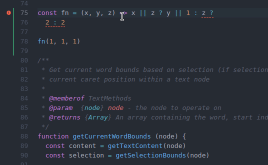

# eslint-plugin-ternary

Catch logical and conditional errors inside ternary expressions. Enforce best practises for
JavaScript ternary operators.

The recommended config of this plugin sets default values on some existing core ESLint rules to
enforce a consistent ternary style. Developers are free to tweak and overwrite any settings
recommended by this plugin.

[](https://badge.fury.io/js/eslint-plugin-ternary)
[](https://david-dm.org/grayedfox/eslint-plugin-ternary)
[](https://david-dm.org/grayedfox/eslint-plugin-ternary?type=dev)
[](https://github.com/prettier/prettier)

- [Installation](#installation)
- [Usage](#usage)
  - [Recommended Config](#recommended-config)
  - [Why Ternary Consequents](#why-nest-ternaries-as-consequents)
- [Rules](#rules)
- [Demo](#demo)
- [Release Notes](#release-notes)
- [Maintainers](#maintainers)
- [License](#license)
- [Futher Reading](#further-reading)

## Installation

You'll first need to install [ESLint](http://eslint.org):

```
$ npm install eslint --save-dev
```

Next, install `eslint-plugin-ternary`:

```
$ npm install eslint-plugin-ternary --save-dev
```

**Note:** If you installed ESLint globally (using the `-g` flag) then you must
also install `eslint-plugin-ternary` globally.

## Usage

Add `ternary` to the plugins section of your `.eslintrc` configuration file. You can omit the
`eslint-plugin-` prefix:

```json
{
    "plugins": [ "ternary" ]
}
```


Then configure the rules you want to use under the rules section.

```json
{
    "rules": {
        "ternary/no-dupe": "warn",
        "ternary/no-unreachable": "error"
    }
}
```

or start with the recommended rule set:

```json
{
  "extends": ["plugin:ternary/recommended"]
}
```

### Recommended Config

The recommended plugin configuration will:

- allow single-line and multi-line ternaries
- enforce multi-line ternary conditions to have precedent (same line) operators
- forbid the use of ternary operators for default assignment
- forbid identical left and right-hand ternary expressions
- forbid equivalent and superfluous ternary conditions (test statements)
- forbid nested ternaries from appearing anywhere else but in the truthy/left-hand/consequent position

Here's why:

```js
// Here the entire tenary operator is unneeded
let isYes = answer === 1 ? true : false
// Error: unnecessary ternary. The above can be automatically fixed to:
let isYes = answer === 1

// Here user.isMember can be truthy or falsy and the returned value will still be 2.00
const getFee = user => user.isMember ? 2.00 : 2.00
// Error: identical left and right-hand expressions '2.00'. What was probably meant:
const getFee = user => user.isMember = 2.00 : 3.00

// Here the value 'y' is unreachable code and will thus never be returned
condition1 && condition2 ? condition2 ? 'x' : 'y' : 'z'
// Error: duplicate ternary conditions 'condition2'. What was perhaps meant:
condition1 ? condition2 ? 'x' : 'y' : 'z'

// Here each ternary test is logically equivalent.
const result = condition1 || condition2 ? condition2 || condition1 ? 'x' : 'y' : 'z'
// Error: equivalent OR ternary conditions 'condition2 || condition1'

// Here condition2 is superfluous, although this does not technically result in unreachable code
const thing = condition1 || condition2 ? condition2 || condition3 ? 'x' : 'y' : 'z'
// Error: duplicate ternary OR conditions 'condition2'. What was perhaps meant:
const thing = condition1 || condition2 ? condition3 ? 'x' : 'y' : 'z'

// Here this multi-line ternary does not have it's operators on the same line
condition ?
  'x' :
  'y'
// Error: '?' and 'e' should be placed at the beginning of the line. This can be automatically fixed to:
condition
  ? 'x'
  : 'y'
  
// Here we have a ternary nested as the right-hand value of a parent ternary:
const fn = (x, y) => x ? 1 : y ? 2 : 3
// Error: nested ternary conditions should appear as consequent (truthy) clause. Prefer:
const fn = (x, y) => x ? y ? 1 : 2 : 3
```

### Why Nest Ternaries As Consequents

It might at first seem strange to prefer that nested (or chained) ternary conditions appear
consequentially but there are several good reasons for this:

1. All of the test conditions are grouped on the left
2. All possible return values are grouped on the right
3. It makes nested ternary conditions more readable and opinionated
4. It forces us to think about test condition order. The 1st condition being tested inside a
   condition chain should be the most determinate (i.e early on conditions should matter the most)
5. It forces the developer to factor in all conditions when evaluating what expression should be
   returned

Take the example functions above. In the first example, the `y` condition is ignored, since if
`x` is truthy the function will always return 1. In the second example `1` will only be returned if
both `x` _and_ `y` are truthy. If it really is integral that your code does something based
on a single condition it probably shouldn't appear in a nested ternary condition in the first place.
In that case use a simple if statement and ensure your code checks that condition as soon as it can
be safely checked:

```
// the below is equivalent to: x ? 1 : y ? 2 : 3
const fn = (x, y) => {
  if (x)
    return 1
  
  y ? 2 : 3
}
```

This is also why it is common practise to handle errors at the beginning of a code block.

As for grouping test conditions, here is an expanded version of the other nested ternary:

```
// the below is equivalent to: x ? y ? 1 : 2 : 3
const fn = (x, y) => {
  if (x && y)
    return 1
   
  if (y)  // if y is true and we reach this part of the code x must be false
    return 2
  else
    return 3
}
```

In the above expanded ternary example, from first glance it might not be clear that the only way
the function returns 3 is if both X and Y are false. We could of course rewrite it to make that
explicit but then we are adding superfluous if conditions and in fact increasing code complexity.

In this case one could argue that the nested ternary function really is easier to comprehend
than the expanded function, so we are not saving lines for the sake of being fancy, but for the
sake of clarity and readability.

For a more detailed explanation of this recommended setting (one that includes data structures)
checkout [this fiddle][1].

## Rules

| rule                                                     | description                                                                      | recommended | fixable  |
| -------------------------------------------------------- | -------------------------------------------------------------------------------- | ----------- | -------- |
| [`no-dupe`][no-dupe]                                     | Forbid identical left and right-hand ternary expressions.                        | :bangbang:  |          |
| [`no-unreachable`][no-unreachable]                       | Forbid equivalent nested ternary conditions which causes unreachable code.       | :bangbang:  |          |
| [`no-unneeded`][no-unneeded]                             | Forbid ternary operators that are strictly unnecessary.                          | :bangbang:  | :wrench: |
| [`nesting`][nesting]                                     | Control where nested ternary operators can appear inside of a parent ternary     | :bangbang:  |          |
| [`operator-linebreak`][operator-linebreak]               | Control where ternary and other symbols (?, :) should appear on newlines         | :bangbang:  | :wrench: |

**Key**

| icon       | description                                     |
| ---------- | ----------------------------------------------- |
| :bangbang: | Reports as error in recommended configuration   |
| :warning:  | Reports as warning in recommended configuration |
| :wrench:   | Rule is fixable with `eslint --fix`             |

## Demo

[](./media/eslint-plugin-demo.gif)

## Release Notes

v1.0.3
- add demo to readme
- fix empty string being reported when OR duplicate exists
- extend recommended config to enforce ternary operators before expressions on multi line ternary

v1.0.4
- make plugin dependency free
- update dev deps

v2.0.0
- fix depth option not being respected (fixing this bug introduces a breaking change)
- update dev deps to next major versions

## Maintainers

- Che Fisher - [@GrayedFox][]

## License

- (c) 2020 Che Fisher <mailto:che.fisher@hey.com> - ISC license.

## Further Reading

Read Eric Elliot's ['Nested Ternaries are Great'][0] for an excellent explanation of the difference
between an if statement and if expression and why nested ternaries are not as bad as they are often
made out to be.

[0]: https://medium.com/javascript-scene/nested-ternaries-are-great-361bddd0f340
[1]: https://jsfiddle.net/fxL5wchd/5/

[no-dupe]: docs/rules/no-dupe.md
[no-unreachable]: docs/rules/no-unreachable.md
[no-unneeded]: https://eslint.org/docs/rules/no-unneeded-ternary
[nesting]: docs/rules/nesting.md
[operator-linebreak]: https://eslint.org/docs/rules/operator-linebreak
[@GrayedFox]: https://github.com/grayedfox
